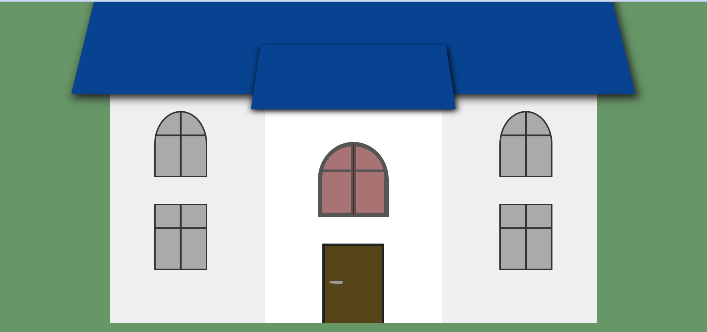

# CSSHouse

## Description
This is an example of a house that is created entirely from HTML and CSS.  A hover effect is in place to open the window.  When a user hovers over the window above the door the window will open up.  JavaScript is used to add an interaction on the from door.  When a user clicks on the front door, the door handle moves to the open position and the front door slowly opens.  When the user clicks on the door again, the opposite happens, the door handle moves to the closed position and the door closes.  this is acheived by placing an event listner on the door that waits for a user click.  The event listner toggles classes on the door and door handle depending on the last click.

## Demo
A demo of the project can be found here at: https://tod619.github.io/CSSHouse/